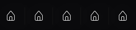
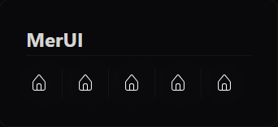
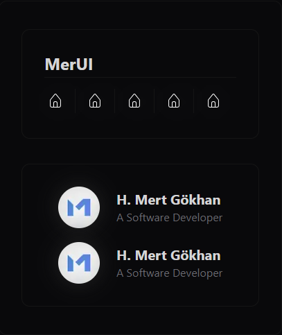

<h1 align="center" style="font-size: 75px;">MerUI</h1>
<p align="center">Open source UI Framework package without any installition. MerUI component list;</p>
<ul>
    <li>AvatarCard</li>
    <li>UnderlineText</li>
    <li>Navigation</li>
    <li>IconLink</li>
    <li>
        IconPackage
        <ul>
            <li>IconItem</li>        
        </ul>    
    </li>
    <li>ModernText</li>
    <li>
        Card
        <ul>
            <li>CardHeader</li>        
            <li>CardBody</li>        
        </ul>    
    </li>
</ul>

<h1 align="center" style="font-size: 35px;">Before Using</h1>
<p align="center">The following packages must be installed for correct use of the MerUI design package.</p>

```
    tailwindcss (depend)
    react-icons (soft-depend) | (p)npm i(nstall) react-icons
```

<h1 align="center" style="font-size: 35px;">Usage</h1>
<p>You can copy the track you want to use directly from <strong>ui/</strong>. It is recommended not to copy intermediate packages. The main reason for this is that intermediate packages cannot be used directly for design.</p>






<h1 align="center" style="font-size: 15px;">Developed by Hacı Mert Gökhan</h1>
